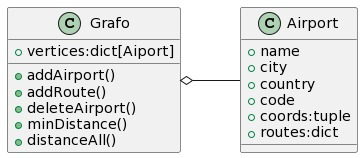

# Lab2_ED2_2023
## Integrantes :books::
+ David Hernandez
+ María Solá
+ Jesus Zuluaga

## Ejecución
Por favor ejecutar Bonito.py

## Librerias
Revisar requirements.txt

## Diagrama de clases


## Algoritmos anteriores de procesamiento
Algunos algortimos usados para facilitar el acceso a los datos y su comprensión no son necesarios ejecutar para usar el proyecto, se muestran por su relevancia en crear el grafo final usado.
### **Conteo de paises repetidos**
```python
countries = []
for country in grafo.vertices.keys():
    countries.append(country)
# guardamos los codigos IATA y los paises del grafo

print([item for item, count in collections.Counter(countries).items() if count > 1])
```
### **Registro de aeropuertos sin rutas**
```python
empty = []
for key,airport in grafo.vertices.items():
    if len(airport.routes) == 0:
        empty.append([key,airport.city,airport.code,len(airport.routes)])
# recorremos grafo guardando información de aeropuertos sin adyacentes

debug = open("data/empty_routes.txt","w",encoding="utf-8")
for x in empty:
    debug.write(f"{str(x)}\n")
debug.close()
# escribimos en archivo la información de la lista 
# para revisar y determinar la causa
```

### **Obtención de rutas adicionales por Airlabs API**
```python
import requests

params = {
  'api_key': 'KEY',
  'dep_iata': 'IATA_CODE'
}
method = 'ping'
api_base = 'http://airlabs.co/api/v9/routes?'
# usando rutas como parametro de búsqueda
api_result = requests.get(api_base+method, params)
api_response = api_result.json()["response"]
# se hace el llamado a la API y accede a la respuesta

with open("country_routes.txt","w") as f:
    for x in api_response:
        y = x["arr_iata"]
        f.write(f"{y}\n")
# se guarda el codigo del aeropuerto de llegada en un archivo para el país
```

## **Referencias**
M. ChatGPT, "How to count repeated elements in dictionary," [Online]. Available: https://stackoverflow.com/questions/9432393/how-to-count-repeated-elements-in-the-dictionary-in-python. [Accessed: Mar. 21, 2023].

M. Bing, "How to remove accents in python," Microsoft Bing Chatbot [Online]. Available: https://github.com/microsoft/bing-chatbot/blob/main/assistant.py. [Accessed: Mar. 20, 2023].

AirLabs, "AirLabs Routes API documentation," [Online]. Available: https://airlabs.co/docs/routes.

T. Schimansky, "TkinterMapView," GitHub, 2022. [Online]. Available: https://github.com/TomSchimansky/TkinterMapView. [Accessed: 03-Apr-2023].

T. Schimansky, "CustomTkinter," GitHub, 2022. [Online]. Available: https://github.com/TomSchimansky/CustomTkinter. [Accessed: 04-Apr-2023].